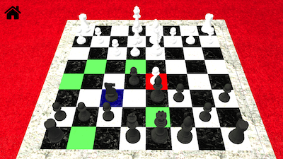

# 3D Chess iOS Application

To compile this project, just open the main Folder in Xcode. Then Click Build.

To install this project onto your iPhone, connect a USB to the computer. Then
log into your Apple ID account and click Devices and select your iPhone. Once that
is set up, just click build and the app will automatically run on your device.

To browse through and understand the project, just open the main folder in finder or
open the main folder in xCode. I put all images and music in the root of the chess
folder.

If you open the trunk/docs folder in the main folder, you can see our powerPoints.

If you open the Chess folder in the main folder, you can see all our code. We made
classes for each piece and view controller. You can also see more art asset folders.
